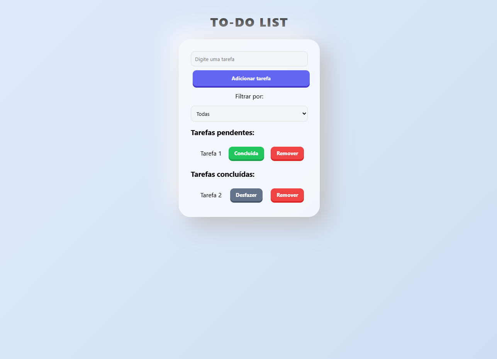

# 📝 Modern 3D To-Do List - React



Uma aplicação avançada de gerenciamento de tarefas desenvolvida em **React**, focada em aplicar arquiteturas modernas de estado global e otimização de performance. O projeto apresenta uma interface visual inspirada nas tendências de **Soft UI (Claymorphism)** e **Glassmorphism**.

## 🚀 Funcionalidades

- **Adicionar Tarefas:** Cadastro de itens com geração de IDs únicos via timestamp.
- **Gerenciamento de Status:** Fluxo completo para marcar tarefas como concluídas ou desfazer a ação.
- **Remoção Inteligente:** Exclusão de itens de forma segura em ambas as listas (pendentes/concluídas).
- **Filtros Avançados:** Filtre sua visão por "Todas", "Pendentes" ou "Concluídas".
- **Interface Moderna:** Design responsivo com efeitos de profundidade 3D e feedback tátil ao clicar nos botões.

## 🛠️ Tecnologias Utilizadas

- **React.js** (Biblioteca principal)
- **Vite** (Ferramenta de build de alta performance)
- **Context API** (Gerenciamento de estado global)
- **Hooks:** `useState`, `useContext`
- **Custom Hooks:** `useInput` para abstração de lógica de formulários.
- **Memoization:** `React.memo` para evitar re-renderizações desnecessárias de componentes.
- **CSS3:** Estilização moderna com variáveis, Flexbox e efeitos de Glassmorphism.

## 🧠 Conceitos Avançados Aplicados

Este projeto foi desenvolvido como parte de uma prática avançada de React, atendendo aos seguintes requisitos técnicos:

1.  **Estado Global com Context API:** Centralização da lógica de tarefas e filtros, permitindo que componentes distantes na árvore se comuniquem sem *prop drilling*.
2.  **Hooks Customizados:** Implementação do hook `useInput` para encapsular e reutilizar a lógica de manipulação de estados de campos de texto.
3.  **Otimização com Memoization:** Uso de `React.memo` no componente de item individual para garantir que a lista permaneça fluida mesmo com muitos elementos.
4.  **Renderização Condicional:** Lógica refinada com operadores `&&` e ternários `? :` para exibir listas ou mensagens de feedback baseadas no estado atual e nos filtros aplicados.
5.  **Imutabilidade:** Manipulação rigorosa de estados através de métodos imutáveis (`.filter`, `.map`, `.find` e o operador *spread*).

## 💻 Instruções para rodar o projeto localmente

Siga os passos abaixo para configurar o ambiente em sua máquina:

1. **Clone este repositório:**
 ```git clone https://github.com/seu-usuario/seu-repositorio.git```

2. **Acesse a pasta do projeto:
 ```cd nome-do-seu-repositorio```

3. **Instalar as dependências:**
 ```npm install```

4. **Executar a aplicação:**
 ```npm run dev```

5. **Acessar no navegador:**
 O Vite geralmente abrirá o projeto em http://localhost:5173.

Desenvolvido por Leonardo Seixas - Estudo de React Avançado.
